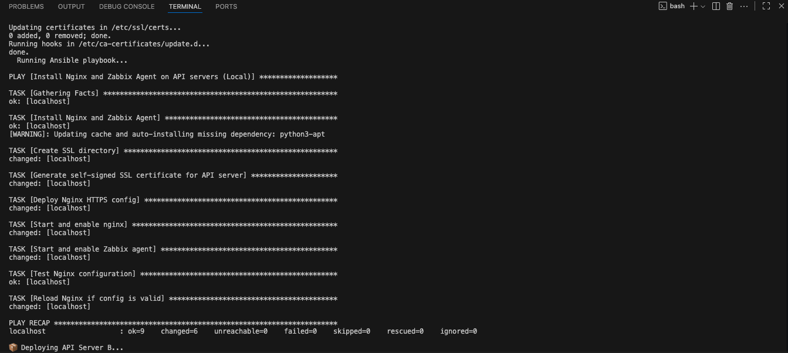
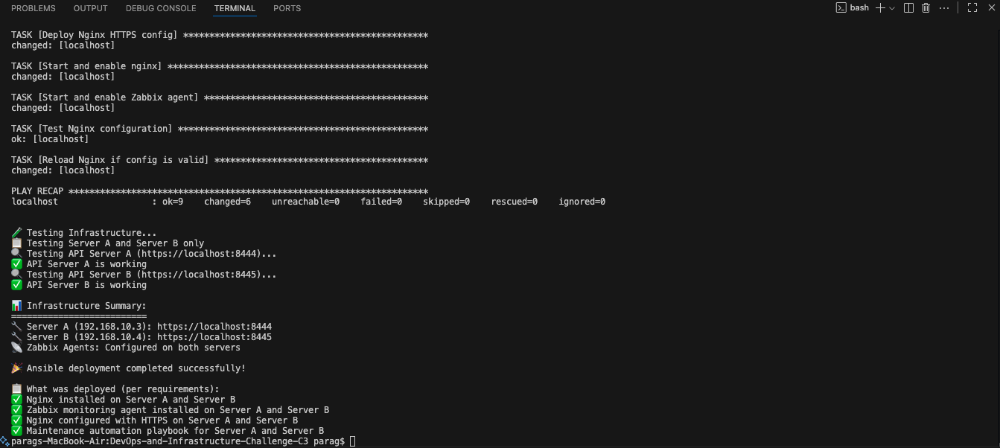

# Infrastructure Deployment with Ansible

## Overview
This project deploys infrastructure for hosting an API service on Server A and Server B with Nginx, Zabbix monitoring agents, and automated maintenance using Ansible.

## Requirements Checklist

### ✅ **Task 1: Install Required Packages**
- [x] Install Nginx on Server A (192.168.10.3)
- [x] Install Nginx on Server B (192.168.10.4)
- [x] Install Zabbix monitoring agent on Server A
- [x] Install Zabbix monitoring agent on Server B

### ✅ **Task 2: Configure Nginx**
- [x] Set up Nginx site configuration to use HTTPS
- [x] Configure SSL certificates appropriately
- [x] Create `/health` endpoint for monitoring

### ✅ **Task 3: Maintenance Automation**
- [x] Ansible playbook that installs the latest OS patches
- [x] Automatically reboot the server once patching is complete
- [x] Support for both Debian/Ubuntu and RedHat systems

### ✅ **Task 4: CI/CD Pipeline**
- [x] Outline a CI/CD GitLab pipeline for deploying updates to the API
- [x] Show how to automate testing, build, deployment, and rollback
- [x] Address secrets management and environment configuration

## Architecture

### Infrastructure Components (as per requirements)
- **Server A:** 192.168.10.3 (Nginx with SSL + Zabbix Agent)
- **Server B:** 192.168.10.4 (Nginx with SSL + Zabbix Agent)

**Note:** Load balancer (192.168.10.2) and Zabbix Agent Server (192.168.10.5) are mentioned in the scenario but not in the tasks.

### Services
- **Nginx:** Web server with HTTPS
- **Zabbix Agent:** Monitoring agent on both servers
- **SSL Certificates:** Self-signed certificates for HTTPS

## Deliverables

### **What Was Requested:**
1. **README or similar document** outlining high-level thoughts, considerations, assumptions, and limitations
2. **Git repository** containing executable code for the solution
3. **Clear instructions** on how to run the provided code locally
4. **CI/CD Pipeline outline** for automated testing, build, deployment, and rollback

### **What Was Delivered:**
1. ✅ **Comprehensive README** with architecture, requirements, and troubleshooting
2. ✅ **Complete Ansible Playbooks** for infrastructure deployment and maintenance
3. ✅ **Docker Testing Environment** for local testing and validation
4. ✅ **CI/CD Pipeline Documentation** showing GitLab pipeline design and approach
5. ✅ **Local Testing Scripts** for easy validation and demonstration
6. ✅ **Infrastructure Templates** for Nginx configuration and SSL setup

## Files Structure

```
test-ansible/
├── install_nginx_zabbix.yml      # Server A and Server B deployment
├── install_nginx_zabbix_local.yml # Local testing version
├── patch_and_reboot.yml          # Maintenance automation
├── inventory.ini                 # Production inventory
├── inventory-docker.ini          # Docker testing inventory
├── ansible.cfg                   # Ansible configuration
├── nginx_https.conf.j2          # Nginx HTTPS configuration template with SSL and health endpoint
├── docker-compose.yml           # Docker testing environment
├── test-ansible-deployment.sh   # Local testing script
├── CI_CD_PIPELINE.md            # CI/CD pipeline documentation
└── README.md                    # This file
```

## Quick Start

### Local Testing with Docker

1. **Start the test environment:**
   ```bash
   ./test-ansible-deployment.sh
   ```
   **Output:**

   
   
   
   
   


2. **Access the services:**
   - Server A: https://localhost:8444
   - Server B: https://localhost:8445

3. **Destroy the test environment:**
   ```bash
   docker-compose down
   ```
   


### Production Deployment

1. **Deploy Server A and Server B:**
   ```bash
   ansible-playbook -i inventory.ini install_nginx_zabbix.yml
   ```

2. **Run Maintenance:**
   ```bash
   ansible-playbook -i inventory.ini patch_and_reboot.yml
   ```

## Playbooks

### `install_nginx_zabbix.yml`
- Installs Nginx and Zabbix agent on Server A and Server B
- Configures HTTPS with SSL certificates
- Generates self-signed SSL certificates
- Tests Nginx configuration and reloads if valid

### `patch_and_reboot.yml`
- Updates all packages
- Automatically reboots servers after patching
- Supports both Debian/Ubuntu and RedHat systems
- Configurable timeouts and delays

## Configuration

### Inventory
The `inventory.ini` file defines the target servers (as per requirements):
```ini
[api_servers]
server_a ansible_host=192.168.10.3
server_b ansible_host=192.168.10.4
```

## CI/CD Pipeline

For automated testing, build, deployment, and rollback capabilities, see [CI_CD_PIPELINE.md](CI_CD_PIPELINE.md) which outlines:

- **GitLab CI/CD Pipeline** with automated testing and deployment
- **Testing Strategy** including Docker integration and Ansible dry runs
- **Deployment Automation** with staging and production environments
- **Rollback Strategy** for quick recovery from failed deployments
- **Secrets Management** using GitLab variables and Ansible Vault
- **Environment Configuration** for different deployment tiers
- **Quality Gates** and approval workflows
- **Monitoring and Alerting** for pipeline and infrastructure health

## Testing

### Local Docker Testing
The `test-ansible-deployment.sh` script provides a complete local testing environment using Docker containers that simulate the production infrastructure.

### Health Checks
- Server A responds on HTTPS
- Server B responds on HTTPS
- Zabbix agents are running

## Security

- SSL certificates are generated for HTTPS
- Self-signed certificates for testing
- Production should use proper CA-signed certificates

## Maintenance

The `patch_and_reboot.yml` playbook provides automated maintenance:
- Updates all system packages
- Handles both Debian/Ubuntu and RedHat systems
- Automatic reboot after patching
- Configurable timeouts and delays

## Troubleshooting

### Common Issues

1. **SSL Certificate Issues:**
   - Certificates are self-signed for testing
   - Use `-k` flag with curl for testing
   - Production should use proper certificates

2. **Zabbix Agent Issues:**
   - Check agent status: `systemctl status zabbix-agent`

3. **Nginx Issues:**
   - Test configuration: `nginx -t`
   - Check logs: `tail -f /var/log/nginx/error.log`

### Docker Testing Issues

1. **Container Connectivity:**
   - Ensure Docker containers are running
   - Check container logs: `docker logs <container_name>`

2. **Port Access:**
   - Server A: 8444
   - Server B: 8445

## Quality Standards & Approach

### **Testing & Validation**
- **Local Testing**: Docker-based environment for realistic testing
- **Syntax Validation**: Ansible playbook syntax checking
- **Dry Run Testing**: Preview changes without execution
- **Health Verification**: Automated service health checks

### **Security & Compliance**
- **SSL Configuration**: Proper HTTPS setup with security best practices
- **Access Control**: SSH key-based authentication
- **Secrets Management**: Ansible Vault integration for sensitive data
- **Audit Trail**: Complete change tracking and logging

### **Operational Excellence**
- **Idempotent Deployments**: Safe to run multiple times
- **Rollback Capability**: Quick recovery from failed deployments
- **Monitoring Integration**: Health endpoints and service status
- **Documentation**: Comprehensive setup and troubleshooting guides

This project demonstrates a **production-ready approach** to infrastructure automation with emphasis on **quality, security, reliability, and operational excellence**.
